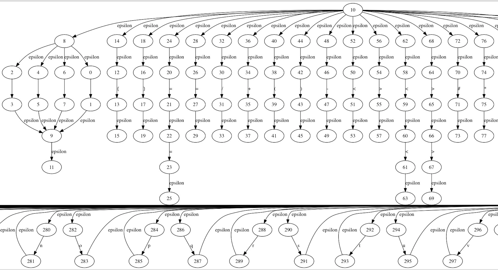
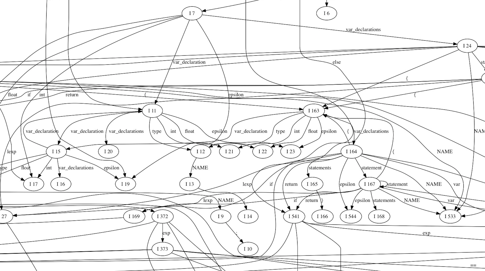

# Compiler
东南大学编译原理课程设计——基于python的Lex和Yacc实现

## Contributor (equal contribution)

|Contributor | Contribution|
|:----:|----|
|[Zhixin Piao](https://github.com/a367) | lex与yacc的文件读取，状态图的生成，最后代码整合 |
|[Shengjia Yan](https://github.com/yanshengjia) | RE  NFA，LR(1)总控程序的实现 |
|[Ruiming Wang](https://github.com/Rimenwang)|NFA  DFA，DFA最小化，LR(1) GOTO图、预测分析表的生成|

## Environment
Python 2.7.10 (64 bit),
networkx 1.10,
pydot 1.0.29,
graphviz 2.38

## Feature
### Lex
* 全部使用python原创编写
* 使用了 networks 中 MutiDiGraph可重边可有回路的有向图来表示 NFA，非常清晰直观
* 最后生成的 NFA、DFA 用 GraphViz 直接画出图形，可以直观方便地观察生成的 结果
* 没有将 RE 中缀转后缀，通过一个 mg_stack 栈和转换函数的递归调用的配合来完成 RE 到 NFA 的转换 
* 可以识别 \( 普通左括号, \) 普通右括号, \*普通乘号 
* 可以识别[a-zA-Z_], 实际上我们是把这种形式的正则表达式预处理了，转化成(a|b|c|….|A|B|C….|_)这种形式再转换

### Yacc
* 通过python动态添加函数的功能将yacc中的语义动作动态的加入类中，从而实现不生成临时代码来执行yacc中的语义动作
* 语法支持epsilon的存在，比如：int main(int a),int main ()都是合法的。实现的方式为PPT表中会存在epsilon这个终结符。当总控程序发现在PPT表中出现error时，会先选择epsilon，观察是否还是error

## Visualization
NFA部分可视化结果（[完整版](https://raw.githubusercontent.com/seucs/compiler/master/graph/nfa.jpg)）：

GOTO图部分可视化结果（[完整版](https://raw.githubusercontent.com/seucs/compiler/master/graph/goto.jpg)）：

DFA部分可视化结果（[完整版](https://raw.githubusercontent.com/seucs/compiler/master/graph/dfa.jpg)）：

